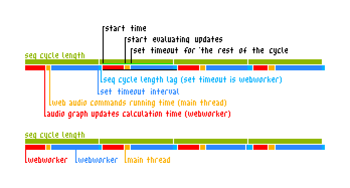

# Development Notes And Future Documentation
## Scheduling
### The Problem

Audio graph updates calculation takes some (a lot) of time. 
The solution is to run it in a WebWorker to avoid main thread freeze.
This introduces another problem, a lag.

